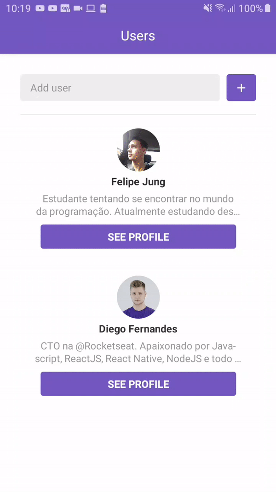

# Rocketseat:rocket: GoStack <a href="https://github.com/Rocketseat/bootcamp-gostack-desafio-06">Challenge 06</a>

## Understanding the application
This app allows you to add your favorite users and to follow to what project theirs stars are going.

<div>


</div>

---

What I learned:

* Routing in React Native
* More about state managing in React
* Differences about React and React Native
* Creating ListViews
* Pulling to Refresh
* Infinity Scrolling

### Run this project

Install de dependencies

```bash
yarn
```

Start de Metro Bundler

```bash
react-native start
```

Start de app

```bash
react-native run-android
```

or

```bash
react-native run-android
```
